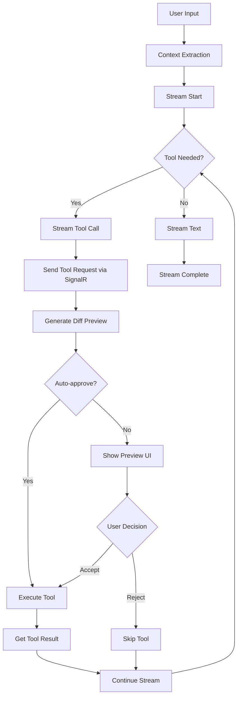

# Cursor-Style Streaming Implementation Plan for GridMate

## Overview
This document outlines the implementation plan to replicate Cursor's streaming pipeline in GridMate, enabling real-time AI responses with tool execution, diff preview, and accept/reject functionality for Excel/Sheets operations.

## Desired End-State Pipeline (Cursor-Style, Adapted for GridMate)

### User Experience Flow

1. **Immediate Message Echo**
   - User types: "Create a DCF model with revenue projections"
   - Message appears instantly with context pills (selected range, sheet name, nearby data)
   - Context pills are color-coded: 📊 ranges, 📄 sheets, 📈 charts, 🔢 named ranges

2. **Status Header During AI Processing**
   - **"Thinking..."** → **"Analyzing spreadsheet structure..."** → **"Planning DCF model..."**
   - In agent mode: Live todo list appears:
     - ✓ Analyze current sheet layout
     - ⚡ Creating revenue assumptions (in progress)
     - ○ Building revenue projections
     - ○ Setting up cost structure
     - ○ Calculating free cash flow
     - ○ Adding terminal value calculation
     ^^ Examples -- should be malleable and able to be for any type of financial model

3. **Streaming Response with Financial Context**
   - AI response streams token-by-token
   - Financial formulas render with syntax highlighting
   - Excel formulas show in familiar Excel notation (e.g., `=NPV(B2,C2:G2)`)
   - Inline previews of cell references on hover

4. **Tool Execution with Excel-Specific Preview**
   ```
   🔧 Tool: write_range
   📍 Range: A1:E20
   📝 Creating DCF structure...
   
   [Preview showing before/after grid]
   - Added cells highlighted in green
   - Modified cells in yellow
   - Formula cells show with ƒ icon
   - Dependent cells marked with arrows
   ```

5. **Visual Diff Review (Excel-Optimized)**
   - **Floating review bar** at bottom: "Review changes: 45 cells affected"
   - Click opens **side-by-side grid comparison**:
     - Left: Current state
     - Right: Proposed changes
     - Color-coded diffs (green=new, yellow=modified, red=deleted)
     - Formula dependency tracking
   - **Accept/Reject** buttons with keyboard shortcuts (⌘+Enter / Esc)

6. **Progressive Tool Execution**
   - Tools execute in sequence with visual feedback
   - Each tool shows progress: "Writing formulas... (12/20 cells)"
   - Failed operations show inline error with retry option
   - Queue shows remaining tools with drag-to-reorder capability

7. **Footer with Financial Model Context**
   - Model type detected: "DCF Model"
   - Affected metrics: "WACC: 8.5% → 9.2%"
   - Formula validation: "✓ Circular references: None"
   - Cost estimate: "~0.02 tokens"

### Technical Pipeline Flow



## Current Architecture Analysis

### What We Have
- ✅ Basic streaming infrastructure (SSE via `/api/chat/stream`)
- ✅ SignalR for real-time bidirectional communication
- ✅ Tool execution framework with autonomy modes
- ✅ Frontend message handlers and chunked rendering
- ✅ **Visual diff preview for Excel edits** (ChatMessageDiffPreview, DiffPreviewBar, ExcelDiffRenderer)
- ✅ **Accept/Reject workflow** (ActionPreview, PendingActionsPanel, useDiffPreview hook)
- ✅ **Diff calculation and visualization** (GridVisualizer, clientDiff, diffSimulator)
- ✅ **Batch operation support** (BatchActionPreview, operation queuing)
- ❌ Continuous streaming with tool results (stream ends after tool execution)

### Key Differences from Cursor
- **Excel/Sheets vs Code Files**: We operate on cells/ranges instead of text files
- **SignalR vs SSE-only**: We use SignalR for tool execution, adding complexity
- **Financial Context**: Our AI needs to understand formulas, dependencies, and financial models

## Existing Components Analysis

### Frontend Components
1. **Diff Preview UI**
   - `ChatMessageDiffPreview.tsx`: Shows diff summary with accept/reject buttons
   - `DiffPreviewBar.tsx`: Floating preview bar with visual indicators
   - `ExcelDiffRenderer.tsx`: Renders different types of diffs (formula, value, format, chart, table)
   - `ActionPreview.tsx`: Preview individual tool actions before execution
   - `PendingActionsPanel.tsx`: Queue of pending actions with batch controls

2. **Diff Calculation**
   - `useDiffPreview.ts`: Hook managing diff generation, preview, accept/reject
   - `GridVisualizer.ts`: Applies visual highlights to Excel cells
   - `clientDiff.ts`: Calculates diffs between Excel states
   - `diffSimulator.ts`: Simulates operations without applying them

3. **State Management**
   - `useDiffSessionStore.ts`: Zustand store for active preview session
   - `diffStore.ts`: Persistent diff history
   - Operation queue management with accept/reject capabilities

## Implementation Phases

## Implementation Details for Each Pipeline Stage

### Stage 1: Message Echo & Context Pills
**Current State**: ✅ Basic message echo
**Needed**:
- Enhanced context pill rendering with Excel-specific icons
- Color coding by context type (range, sheet, chart, table)
- Clickable pills to navigate to source

### Stage 2: Status Header with Live Progress
**Current State**: ❌ No status header
**Needed**:
- Streaming status component with phase indicators
- Agent todo list with real-time updates
- Integration with backend progress tracking

### Stage 3: Token Streaming with Excel Formula Rendering
**Current State**: ✅ Basic token streaming
**Needed**:
- Excel formula syntax highlighter
- Inline cell reference previews
- Financial formula recognition (NPV, IRR, etc.)

### Stage 4: Tool Execution with Preview
**Current State**: ✅ Tool preview UI exists, ❌ Not connected to streaming
**Needed**:
- Connect streaming tool calls to preview system
- Real-time diff generation during streaming
- Progressive preview updates

### Stage 5: Visual Diff Review
**Current State**: ✅ Comprehensive diff UI exists
**Needed**:
- Keyboard shortcuts (⌘+Enter, Esc)
- Integration with streaming flow
- Auto-advance after accept/reject

### Stage 6: Progressive Tool Queue
**Current State**: ✅ Basic queue exists
**Needed**:
- Progress indicators per tool
- Drag-to-reorder functionality
- Retry mechanism for failed tools

### Stage 7: Financial Context Footer
**Current State**: ❌ No financial context display
**Needed**:
- Model type detection display
- Key metrics tracking
- Formula validation status

## Phase 1: Fix Streaming Continuation After Tool Execution (1-2 days)

### Backend Changes

#### 1.1 Modify AI Service to Support Continuous Streaming
```go
// internal/services/ai/service.go
type StreamingSession struct {
    ID              string
    Context         context.Context
    Messages        []Message
    FinancialContext *FinancialContext
    ToolResults     map[string]interface{}
    CurrentPhase    StreamPhase // "initial" | "tool_execution" | "final"
}

// ProcessChatMessageStreaming should support multiple phases
func (s *Service) ProcessChatMessageStreaming(ctx context.Context, session *StreamingSession) (<-chan CompletionChunk, error)
```

#### 1.2 Implement Tool Result Injection
```go
// internal/services/excel_bridge.go
func (eb *ExcelBridge) processStreamingChunksWithTools() {
    // After tool execution, inject results back into AI stream
    case "tool_complete":
        // Execute tool and get result
        result := eb.executeToolViaSignalR(tool)
        
        // Continue AI stream with tool result
        session.ToolResults[tool.ID] = result
        session.CurrentPhase = "tool_execution"
        
        // Re-invoke AI with tool results
        continuationStream := eb.aiService.ProcessChatMessageStreaming(ctx, session)
        // Merge continuation stream with output
}
```

#### 1.3 Add Streaming State Management
```go
type StreamingState struct {
    SessionID       string
    MessageID       string
    Phase           StreamPhase
    PendingTools    []ToolCall
    ExecutedTools   map[string]ToolResult
    ContentBuffer   strings.Builder
    StartTime       time.Time
}
```

### Frontend Changes

#### 1.4 Update Message Handlers for Multi-Phase Streaming
```typescript
// src/hooks/useMessageHandlers.ts
interface StreamingSession {
  messageId: string;
  phase: 'initial' | 'tool_execution' | 'final';
  pendingTools: ToolCall[];
  executedTools: Record<string, any>;
  contentChunks: string[];
}

const handleStreamChunk = (chunk: StreamChunk) => {
  switch (chunk.type) {
    case 'phase_change':
      session.phase = chunk.phase;
      break;
    case 'tool_continuation':
      // Handle continuation after tool execution
      break;
  }
};
```

## Phase 2: Integrate Existing Diff Preview with Streaming (1-2 days)

Since we already have comprehensive diff preview components, we need to integrate them with the streaming flow:

### 2.1 Connect Streaming to Diff Preview
```typescript
// Modify useMessageHandlers.ts to trigger diff preview during streaming
const handleToolRequest = async (data: any) => {
  if (streamingMode || autonomyMode === 'full-autonomy') {
    // Generate preview for streaming tools
    const operations = convertToolToOperation(data);
    await generateBatchedPreview(messageId, operations);
  }
};
```

### 2.2 Enhance DiffPreviewBar for Streaming Context
- Add streaming indicator when preview is being generated
- Show "AI is working..." status during tool execution
- Auto-advance to next tool after accept/reject

### 2.3 Update PendingActionsPanel for Real-time Updates
- Show tools as they stream in from AI
- Display execution status in real-time
- Handle concurrent tool approval/rejection

## Phase 3: Enhance Tool Execution Pipeline (1-2 days)

### 3.1 Streaming-Aware Tool Queue
```typescript
// Enhance existing useOperationQueue.ts
interface StreamingToolQueue {
  mode: 'streaming' | 'batch';
  autoAdvance: boolean;
  pendingTools: ToolCall[];
  activeToolIndex: number;
  
  // New methods for streaming
  addStreamingTool: (tool: ToolCall) => void;
  processNextTool: () => void;
  pauseQueue: () => void;
  resumeQueue: () => void;
}
```

### 3.2 Real-time Preview Generation
- Modify `useDiffPreview` to support incremental preview updates
- Add debouncing for rapid tool additions during streaming
- Implement progressive diff calculation for large operations

## Phase 4: Progress and Status Indicators (1-2 days)

### 4.1 Implement Status Header Component
```tsx
// src/components/StreamingStatus.tsx
interface StreamingStatusProps {
  status: 'thinking' | 'planning' | 'executing' | 'reviewing';
  todoList?: AgentTodo[];
  progress?: number;
}

const StreamingStatus: React.FC<StreamingStatusProps> = ({ status, todoList }) => {
  return (
    <div className="streaming-status">
      <StatusIcon status={status} />
      <span className="status-text">{getStatusText(status)}</span>
      
      {todoList && (
        <div className="agent-todos">
          {todoList.map(todo => (
            <TodoItem
              key={todo.id}
              text={todo.text}
              completed={todo.completed}
              active={todo.active}
            />
          ))}
        </div>
      )}
    </div>
  );
};
```

### 4.2 Add Progress Tracking to Backend
```go
// internal/services/streaming_progress.go
type ProgressTracker struct {
    mu       sync.RWMutex
    sessions map[string]*SessionProgress
}

type SessionProgress struct {
    Status    string
    TodoList  []TodoItem
    Progress  float64
    StartTime time.Time
}

func (pt *ProgressTracker) UpdateTodo(sessionID string, todoID string, completed bool) {
    // Send progress update through SignalR
    pt.signalR.SendProgressUpdate(sessionID, ProgressUpdate{
        Type:      "todo_update",
        TodoID:    todoID,
        Completed: completed,
    })
}
```

## Phase 5: Financial Model Awareness (3-4 days)

### 5.1 Enhance Context Builder for Model Detection
```go
// internal/services/excel/model_detector.go
type ModelDetector struct {
    patterns map[ModelType][]Pattern
}

type ModelType string
const (
    ModelTypeDCF    ModelType = "dcf"
    ModelTypeLBO    ModelType = "lbo"
    ModelTypeComps  ModelType = "comps"
)

func (md *ModelDetector) DetectModelType(
    workbook *WorkbookData,
) (ModelType, float64) { // returns type and confidence
    // Analyze sheet names, cell patterns, formulas
    // Return detected model type with confidence score
}
```

### 5.2 Add Model-Specific Tool Selection
```typescript
// src/services/ai/toolSelection.ts
const selectToolsForModel = (
  modelType: ModelType,
  userIntent: string
): ToolDefinition[] => {
  const baseTools = ['read_range', 'write_cell', 'create_formula'];
  
  switch (modelType) {
    case 'dcf':
      return [...baseTools, 'create_dcf_schedule', 'calculate_wacc', 'terminal_value'];
    case 'lbo':
      return [...baseTools, 'debt_schedule', 'returns_analysis', 'cash_sweep'];
    default:
      return baseTools;
  }
};
```

## Phase 6: Integration Testing & Polish (2-3 days)

### 6.1 End-to-End Test Scenarios
1. Simple cell edit with preview/accept/reject
2. Complex formula creation with dependency tracking
3. Multi-tool DCF model creation
4. Error handling and recovery
5. Concurrent user operations

### 6.2 Performance Optimizations
- Implement chunk batching for rapid token streams
- Add caching for Excel state snapshots
- Optimize diff generation for large ranges
- Implement progressive rendering for large diffs

### 6.3 UI/UX Polish
- Add keyboard shortcuts (Cmd+Enter to accept all, Esc to reject)
- Implement drag-to-reorder for tool queue
- Add cost estimation before execution
- Show formula dependency graph in preview

## Implementation Timeline (Revised)

| Week | Phase | Deliverables |
|------|-------|--------------|
| 1 | Phase 1 | Streaming continuation after tools |
| 1 | Phase 2 | Integrate existing diff preview with streaming |
| 1-2 | Phase 3 | Enhance tool execution pipeline |
| 2 | Phase 4 | Progress indicators and status |
| 2-3 | Phase 5 | Financial model awareness |
| 3 | Phase 6 | Testing and polish |

**Note**: Timeline reduced from 4 weeks to 3 weeks since we already have diff preview and tool approval components.

## Success Metrics

1. **Streaming Performance**
   - First token latency < 500ms
   - Smooth streaming at 30+ tokens/second
   - Tool execution adds < 200ms latency

2. **User Experience**
   - 95% of diffs reviewable in < 2 seconds
   - Undo/redo works reliably
   - No data loss on reject operations

3. **Financial Accuracy**
   - 100% formula preservation on accept/reject
   - Dependency tracking catches all affected cells
   - Model type detection > 90% accurate

## Key Implementation Patterns (From Cursor Analysis)

### 1. Streaming Architecture
```typescript
// Cursor uses SSE with chunked transfer for all streaming
// GridMate adaptation: Keep SignalR for tools, SSE for text

interface StreamChunk {
  type: 'text' | 'tool_start' | 'tool_progress' | 'tool_complete' | 'status' | 'done';
  delta?: string;
  toolCall?: ToolCall;
  status?: StreamStatus;
  done?: boolean;
}
```

### 2. Diff Session Management
```typescript
// Cursor: DiffReviewSession created AFTER stream completes
// GridMate: Create session during streaming for real-time preview

interface DiffSession {
  messageId: string;
  streamPhase: 'active' | 'reviewing' | 'completed';
  operations: AISuggestedOperation[];
  snapshot: WorkbookSnapshot;
  hunks: DiffHunk[];
  appliedTools: string[];
}
```

### 3. Tool Execution Flow
```typescript
// Cursor: Tools pause stream, execute, then continue
// GridMate: Tools execute async via SignalR while stream continues

const handleToolDuringStream = async (toolCall: ToolCall) => {
  // 1. Send tool request via SignalR
  await signalR.sendToolRequest(toolCall);
  
  // 2. Generate preview immediately
  await generatePreview(toolCall);
  
  // 3. Continue streaming while tool executes
  // 4. Inject tool result when available
};
```

### 4. Accept/Reject Integration
```typescript
// Cursor: workspace.applyEdit for accept, restore snapshot for reject
// GridMate: ExcelService.executeToolRequest for accept, GridVisualizer.clearHighlights for reject

const acceptChanges = async (diffSession: DiffSession) => {
  // Execute all operations
  for (const op of diffSession.operations) {
    await excelService.executeToolRequest(op.tool, op.input);
  }
  
  // Clear visual highlights
  await GridVisualizer.clearHighlights(diffSession.hunks, undefined, true);
  
  // Update audit trail
  await trackAcceptance(diffSession);
};
```

## Risk Mitigation

1. **SignalR Complexity**: Keep hybrid approach - SSE for streaming, SignalR for tools
2. **Excel API Limitations**: Use batched operations with rollback capability
3. **Performance at Scale**: Implement virtual scrolling for large diffs
4. **Concurrent Edits**: Add session locking during preview mode

## Next Steps

1. Create feature branch: `feature/cursor-style-streaming`
2. Implement streaming continuation (Phase 1) - Critical path
3. Connect existing diff preview to streaming (Phase 2)
4. Add progress indicators and polish (Phases 3-6)
5. Set up E2E tests for complete pipeline